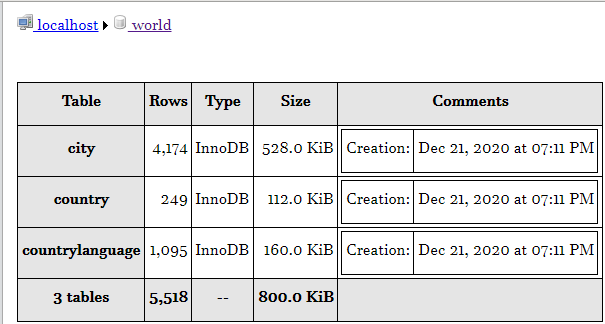
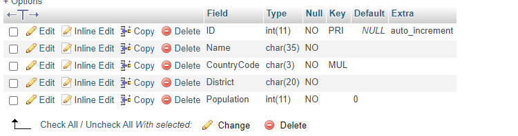

# Database and Structured Query Language
In this journey we can be able to learn what a database (world is the name of the database) is all about. And know what are the sample queries (SQL) that we can perform in organizing data in all sorts of systems in our relational database. 

# Where it came from
In performing our queries, the database that is being used wasn’t mine. The sample data used in the world database is Copyright Statistics Finland, http://www.stat.fi/worldinfigures.

# Database all about
This database shows the different continents of the world and the country that are part of its continent and region. It includes demographic profile, surface area, the gross national product, language that is being used and also the form of the government. 

