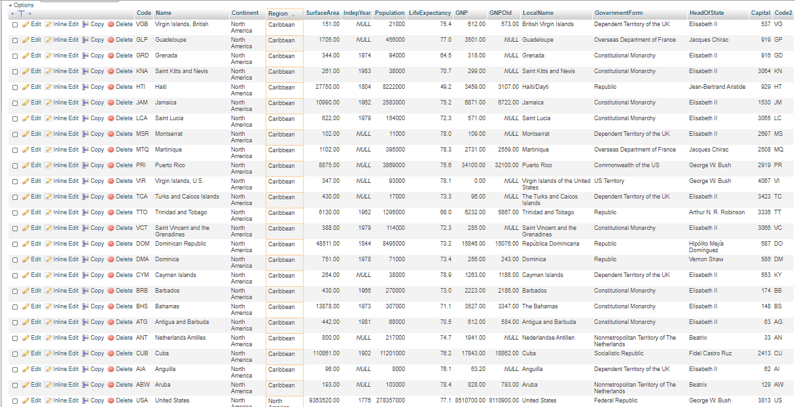

# Database and Structured Query Language
In this journey we can be able to learn what a database (world is the name of the database) is all about. And know what are the sample queries (SQL) that we can perform in organizing data in all sorts of systems in our relational database. 

# Where it came from
In performing our queries, the database that is being used wasn’t mine. The sample data used in the world database is Copyright Statistics Finland, http://www.stat.fi/worldinfigures.

# Database all about
This database shows the different continents of the world and the country that are part of its continent and region. It includes demographic profile, surface area, the gross national product, language that is being used and also the form of the government. 

# Where does it come from?
As I have stated above, the database wasn’t mine. You can download the world database on the link below.
	https://blog.sqlauthority.com/2020/02/15/mysql-download-sample-database-sakila-world-employee/

# Table name and description
###### City 
Settled place and boundaries. In this table it showed attributes of ID, name (city), country code, district and population. 
###### Country
Land of individuals and how it is governed. This table showed attributes of code, name (country),continent, region, surface area, independence year, population, life expectancy, gross national product, gross national product (old), local name, government form, head of state, code.
###### Country language
Structured system of communication. In this table it showed attributes of country code, language and percentage.

# Database Dependency Diagram

# Complex Queries
###### Query 1: Show Table Statement 
use to describe the list of column definitions for specific table.

Importance: It helps to analyze the structured table of a database. We see the column names and their data types. Plus other important information.

    Mysql > DESCRIBE City;
  ###### Result
  
  
  
  ###### Query 2: Limiting Data Output 
  control the number of rows to be displayed with the LIMIT clause.
  
  Importance: There are thousands of rows in the tables of the database. They cannot be displayed all on the screen. We can control the number of rows to be displayed with the     LIMIT clause.
  
	  Mysql > SELECT Id, Name, Population FROM city limit 10;
  ###### Result

  
  
  ###### Query 3: NOT NULL, ORDER BY, & LIMIT 
  remove any null values using IS NOT NULL so that we are only working with real data, use ORDER BY to filter the Population field, know the lowest value by using ascending       order, using ASC.And use LIMIT to restrict the number of values returned to one, which yields one value: the country with the lowest population.

  Importance: NOT NULL constraint in SQL is used to prevent inserting NULL values into the specified column, considering it as a not accepted value for that column. ORDER BY       keyword is used to sort the result-set in ascending or descending order. Limit the number of records returned based on a limit value. 

	  Mysql > SELECT Name, Population FROM Country WHERE Population = (SELECT MAX(Population) FROM Country WHERE Continent = 'Europe');
  ###### Result
	
  
  
  ###### Query 4: LEFT JOIN, & ON
  a clause that allows you to query data from multiple tables. 

  Importance: It is used to combine rows from multiple related tables in a relational database, making use of Primary Keys and Foreign Keys. 

	  Mysql > SELECT world.country.Region, world.countrylanguage.Language FROM world.country LEFT JOIN world.countrylanguage ON world.country.Code = world.countrylanguage.CountryCode WHERE world.country.Region = "Caribbean"
	  
  ###### Result
	
  
  
  ###### Query 5: LENGTH 
  returns the number of bytes in some relational database systems.
  
  Importance: The length is important if it might breach some limits, but query performance will not be affected by it, nor security.

	  Mysql > SELECT Name, LENGTH(Name), Continent, LENGTH(Continent), Capital, LENGTH(Capital) FROM country WHERE name LIKE 'G%';
  ###### Result
	
  
  
  ###### Query 6: Order by
  statement in sql is used to sort the fetched data in either ascending or descending according to one or more columns. 

  Importance: It helps to sort data from the biggest to smallest data and vice versa. 

	  Mysql > SELECT Name, Population FROM Country WHERE Continent = 'South America' ORDER BY Population DESC ;
  ###### Result
	
  
  
  ###### Query 7: MAX function 
  returns the largest value of the selected columns.

  Importance: It helps to identify the largest value of the selected columns. 

	  Mysql > SELECT Name, Population FROM Country WHERE Population = (SELECT MAX(Population) FROM Country WHERE Continent = 'Europe');
  ###### Result
	
  
  
  ###### Query 8: Group By 
  The ‘Group By’ property groups the resulting data according to the specified attribute.

  Importance: It allows you to collapse a field into its distinct values. This clause is most often used with aggregations to show one value per grouped field or combination of fields. 

	  Mysql > SELECT Code, Name, Population, GovernmentForm FROM country WHERE GovernmentForm = 'Republic' GROUP BY Code, Name, Population ORDER BY Code
  ###### Result
	
  
  
  ###### Query 9: COUNT Function
  returns the number of rows in a table satisfying the criteria specified in the WHERE clause.

  Importance: Ignored duplicate values and COUNT returns the number of unique non null values.

	  Mysql > SELECT COUNT(Continent), Continent  FROM Country WHERE Continent = 'Asia' ;
  ###### Result
	
  
  
   ###### Query 10: SUM FUNCTION 
   calculates the total of the attribute that is given to it as an argument. SUM is an aggregate function and it calculates the sum of all the distinct values. and sum of all      the duplicate values.

  Importance:  It helps to perform a calculation on a set of values, and returns a single value. 

	  Mysql > SESELECT SUM( Population ) FROM country WHERE Continent = 'Asia'
  ###### Result
	
  
  
  ###### Query 11: AVERAGE (AVG) Function 
  a function computes the average of non-NULL values in a column. It ignores the null values.

  Importance:  Just like the SUM function it helps to perform a calculation on a set of values, and returns a single value and null value is ignored. 

	  Mysql > SELECT AVG( Percentage ) FROM countrylanguage WHERE Language = 'English'
  ###### Result
	
  
  
   ###### Query 12: INNER JOIN 
   keyword selects records that have matching values in both tables.

  Importance:   The query compares each row of table1 with each row of table2 to find all pairs of rows which satisfy the join-predicate. When the join-predicate is satisfied,     column values for each matched pair of rows of A and B are combined into a result row.

	  Mysql > SELECT (CountryCode), ID FROM city  INNER JOIN country ON city.CountryCode = country.Code GROUP BY ID;
  ###### Result
	
  
  
  ###### Query 13: RIGHT JOIN
  returns all rows from the right table, even if there are no matches in the left table. This means that if the ON clause matches 0 (zero) records in the left table; the join     will still return a row in the result, but with NULL in each column from the left table.

  Importance:    It means that a right join returns all the values from the right table, plus matched values from the left table or NULL in case of no matching join predicate.

	  Mysql > SELECT country.Name, countrylanguage.Language FROM country RIGHT JOIN countrylanguage ON country.Code = countrylanguage.CountryCode
  ###### Result
	
  
  
   ###### Query 14: LIKE Clause 
   is used in a WHERE clause to search for a specified pattern in a column.

  Importance: It allows you to use wildcards ( character is used to substitute one or more characters in a string.) to perform pattern matching in a query.

	  Mysql > SELECT * FROM city WHERE CountryCode LIKE 'PHL%' ORDER BY Name
  ###### Result
	
  
  
   ###### Query 15: BETWEEN Function 
   operator selects values within a given range. The values can be numbers, text, or dates.
	
  Importance: This query uses the greater than or equal (>= ) and less than or equal ( <= ) operators, or the shorthand for  >= AND <=. It's easy to identify the given range.

	  Mysql > SELECT * FROM Country WHERE Population BETWEEN 10000000 AND 120000000 ORDER BY Population;
  ###### Result
	
  
  
  ###### Query 16: IN Clause 
  allows you to specify multiple values in a WHERE clause. The IN operator is a shorthand for multiple OR conditions.

  Importance: It encapsulates the query containing the LEVEL information in the FROM clause.

	  Mysql > SELECT * FROM country WHERE Region IN ('Caribbean', 'South America', 'North America') ORDER BY Region
  ###### Result
	
  
  
   ###### Query 17: ORDER BY (Ascending(ASC) Function
   is used to sort the fetched data in ascending order.

  Importance: It helps to sort data from smallest to biggest range.

	  Mysql > SELECT Language, COUNT( CountryCode ) AS N FROM CountryLanguage WHERE Percentage >=50 GROUP BY Language HAVING N >2 ORDER BY `N` ASC
   ###### Result 
	
  
  
  ###### Query 18: INSERT INTO
  is used to add new rows of data to a table in the database.

  Importance: It is a shorthand for inserting data in a table.

	  Mysql > INSERT INTO countrylanguage VALUES ('USA', 'C++', 'F', 0.5)
   ###### Result 
	
  
  
  ###### To show Insertion query

    Mysql > SELECT CountryCode FROM countrylanguage WHERE Percentage = 0.5 AND Language = 'C++'
   ###### Result 
   
   
    
   ###### Query 20: UPDATE
   statement changes the data of one or more records in a table. Either all the rows can be updated, or a subset may be chosen using a condition. 

  Importance:  It is used to modify the existing records in a table. You can use the WHERE clause with the UPDATE query to update the selected rows, otherwise all the rows would   be affected.

	  Mysql >UPDATE CountryLanguage SET IsOfficial = 'T' WHERE CountryCode = 'ABW' AND Language = 'English';
   ###### Result 
	
  
  
   # Before
   ###### Result 
   
   
   
   # After
   ###### Result 
   
   
   
  
  
    
    
